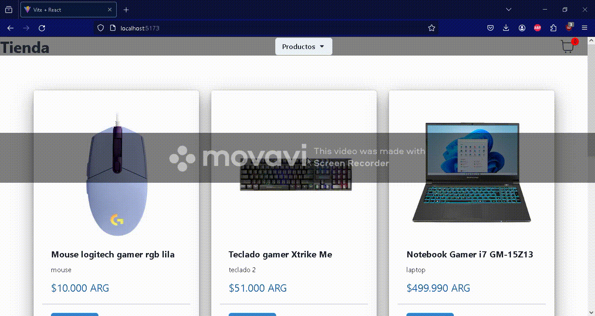

# React E-commerce

---

### Descripcion

E-commerce realizado en el curso de ReactJS de Coderhouse

---

### Muestra de como funciona

---

### Deploy
    [React E-commerce](https://pre-entrega2-dylan-rothermel.vercel.app/) - Deploy en Vercel

## Herramientas
    Chakra
    Axios
    Firebase
    React-icons
    React-router-dom
    Sweetalert2

---

### Como instalar la app

* Paso 1 - Clonar el repositorio:
    * git clone https://github.com/Dylanrothermel/ProyectoFinalReactDylanRothermel
* Paso 2 - Moverse a la carpeta del proyecto:
    * cd nombreDeLaCarpeta
* Paso 3 - Instalar las dependencias:
    * npm i
* Paso 4 - Compilar:
    * npm run dev

---

### Estructura del E-commerce:

#### Navbar:
    * Logo del E-commerce
    * Tienda te lleva a la landing page
    * Dropdown con las categorías
    * Ícono del carrito

#### Body
    * Contenedor con todos los productos

#### Navegación
    * El dropdown con las categorías filtra los productos por categoría
    * El icono del carrito te lleva al carrito
    * El botón de ver detalles debajo de los productos te lleva a los detalles del producto, dónde también puedes añadir ese producto al carrito
    * Cúando pulsas el botón añadir al carrito, el botón desaparece y aparece un botón que te lleva al carrito

#### Carrito
    * En el carrito se muestran todos los productos que añadiste, el nombre del producto, la cantidad que añadiste por producto,
    el precio del producto, el subtotal y el total de la compra
    * El botón eliminar elimina el producto del carrito
    * El botón vaciar elimina todos los producto que hay en el carrito
    * El botón finalizar compra te lleva al checkout, dónde tienes que ingresar tus datos y pulsar el botón finalizar compra

---

### Contacto

link a linkedin